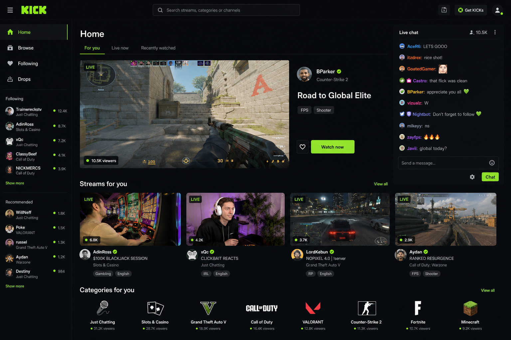
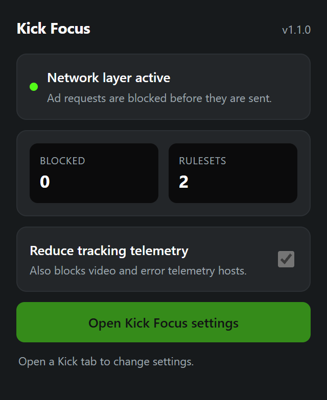

# Kick Focus

[](CHANGELOG.md)
[](LICENSE)
[](#desktop-support)
[](package.json)

Kick Focus is a desktop-only userscript that gives [Kick](https://kick.com/) a calmer, more premium, and more controllable layout. It adds a consistent graphite-and-lime site shell, focus and theater modes, compact discovery, a complete settings center, accessibility controls, content filters, and a best-effort document-start ad defense without shipping remote code.

An optional Manifest V3 companion extension adds the one thing a userscript on Chromium can no longer do for itself: blocking ad requests at the browser network layer, before they are sent.



## What it changes

- Restyles Kick's current semantic desktop shell, navigation, discovery rail, content cards, player, chat, tabs, search results, and empty states with one restrained premium design system.
- Reclaims the permanent discovery rail with Auto, Compact, Dropdown, and Hidden modes; Auto is the default so the live site can choose the appropriate desktop width. Dropdown collapses the rail to a tab that expands on hover or keyboard focus.
- Adds Standard, Theater, and Focus stream layouts, plus Right, Docked, and Hidden chat.
- Widens browse grids and preserves a compact, sticky desktop top bar. Following and Drops are classified as first-class routes instead of being mistaken for channels.
- Adds a searchable command menu (`Ctrl+K`) and configurable keyboard shortcuts.
- Adds Studio, OLED, and Slate surfaces; four ready-made viewing presets; four branded accents plus a contrast-protected custom color; density, radius, thumbnail, contrast, and text controls. Calm, Cinema, Chat First, and Discovery apply coherent layout and style choices without changing content filters or account settings.
- Keeps home-page previews silent, blurs marked mature cards, and can filter casino, Drops, sponsored, and promoted content using Kick's own category and badge markup. Filtering suspends itself and says so rather than emptying a page.
- Adds an opt-in **Poor mode** that removes Subscribe, Gift Subs/Dubs, Get KICKs, gift-shop controls, and spend-based leaderboards while preserving Follow, chat, and free daily rewards. It identifies exact controls instead of hiding arbitrary text. It also reaches the two spend surfaces that are not controls — the KICKs balance in the chat footer and the gift-shop panel — by test id, which is why the free channel-points counter sitting directly beside the balance is left alone.
- **Says what your account can actually send, and where.** Kick's emote endpoint answers differently depending on who asks: read with your own session it returns every channel you subscribe to and the collectibles you have pulled, not just the channel you are looking at. That answer is used as the entitlement it is, so an emote you own reads as available and one you do not is marked as such rather than left unconfirmed. Reach is shown separately from ownership, because they are different facts — a *free* channel emote works only in that channel, while a subscriber emote you own works in every chat. Kick's own picker states neither, and only ever shows the channel you are standing in.
- **Shows how long the stream has been live.** Kick sends the start time with every channel and displays it nowhere. The clock costs no extra request, and falls back to the start time in Kick's own structured data in the page, so it survives the channel API rate-limiting your tab.
- Remembers volume, mute state, quality, and finite VOD position locally with separate privacy toggles; adds favorite and not-interested card actions, configurable Following/Recommended rails, an accessible search summary and clear action, useful Drops-empty guidance, and mini-player collision recovery.
- **Switches off Kick's own controls you never use.** A grid on the Layout page turns off eight player controls — miniplayer, clip, theater, fullscreen, the quality gear, volume, share, report — and six sidebar entries: the Home, Browse, Following and Drops links, and the followed and recommended channel lists. Each is hidden with styling only: the control stays in the page with everything Kick wired to it intact, and switching it back on restores it without a reload. They are located through the same ordered probe list the rest of the mod uses, so a Kick rename is reported by the live gate instead of quietly hiding nothing.
- **Always start at the highest quality** (off by default). Opens every stream at the best rung Kick offers on that channel, taking precedence over remembered quality. The rungs are learned from Kick's own quality menu rather than hard-coded, because the set differs per channel — so it does nothing until that menu has been opened once, and it will not open the menu for you. A rung Kick has badged as unavailable to your session is never recorded and never selected; signed out, that is the 1080p60 row, and the best rung becomes 720p60.
- Adds sticky chat pause with an accessible resume state, per-channel keyword highlights and private notes, optional playback diagnostics, and a panic switch that restores Kick's native page without a reload.
- Continuously records emotes seen in live chat and every emote Kick exposes in the open picker, including locked metadata, with a larger three-row one-click favorites shelf, scroll-stable removals, portable favorites/removals, custom groups, and full JSON export/import from settings. Click any emote in chat to save it immediately. When Kick explicitly marks that emote as follow-gated, the same click follows its source channel without navigating away and offers an Undo action; subscriber-only access is never bypassed. Hovering a chat emote shows what it is — name, Kick set, access level, first capture, whether you already have it, and which set wins if the name is shadowed. The library can also browse any named channel's public emote artwork on demand and labels free emotes channel-only and subscriber emotes locked until Kick confirms access. Every recorded emote offers Copy name, and an off-by-default setting adds Type in chat, which places the plain name at your cursor and never sends.
- **The emote picker is ranked and windowed.** Two shelves sit above the grid — **Most used** and **Recent** — built from the usage this project already counts, scoped to the channel you are in and falling back to your overall history for anything you have not sent there. Only the tiles near the viewport are put in the page, with a spacer holding the scroll height for the rest, so a library at the 2400 cap costs one window of nodes instead of 2400. The picker's search waits for you to stop typing, and favouriting or removing an emote updates that one tile rather than rebuilding the grid, so images already on screen are never re-fetched.
- **Emote suggestions as you type** (off by default). A colon and two or more letters offers matching emotes from your library — names that *start* with what you typed ahead of names that merely contain it, then your favourites, then what you actually send in that channel. Click one and its plain name goes in at your cursor. Suggestions are accepted by click only: nothing here listens for a keystroke, so it cannot take a key meant for Kick's own composer, and it never sends the message.
- Clears the ad flags out of Kick's `/playback` response before the player reads them, so the ad SDKs are never started, and blocks known ad and optional telemetry requests through early page-realm `fetch`, XHR, beacon, and dynamic-element hooks. A persistent observer removes ad scripts, frames, and containers after reinsertion, and the Content & Ads page warns if Kick's ad stack stops matching what this build knows.
- **Reads Kick's own API instead of scraping the page for it**, read-only and same-origin using the session you are already signed into. Public emote catalogs are treated as artwork catalogs—not proof of account entitlement; chat events come from whichever realtime provider Kick's own broker names; removed messages say why they were removed, which the page itself discards; emote usage is counted per channel and globally, which Kick does not do at all; collectible rarity is resolved and shown only where the match is confident; wide collectibles render un-squashed; and emote names shadowed across your sets are reported. Every one of these degrades to the previous DOM behaviour if the response changes shape, and each has its own switch.
- **Claims Kick's daily reward for you** (off by default). When one is waiting, it opens Kick's own reward dialog, clicks its claim button, closes it, and gives you focus back. It clicks nothing else and never touches a claim endpoint — a reward Kick has not unlocked yet shows a disabled button, and that refusal is obeyed rather than worked around. It waits until you are not typing, and it schedules itself from what Kick says rather than polling: the dialog's own "Watch N more minutes" sets the next look, and a reward already collected sleeps until the 8pm rollover. That is about three openings of Kick's dialog a day. The schedule is shared across your open tabs, so four tabs do not each check.
- **Multi-stream**: up to nine channels in one grid, built on Kick's own embedded player and popout chat, with audio and chat following the focused tile and named layouts you can save. Reachable from the header control, the command menu, or settings. Every stream card on Home, Browse, Following, and Search carries a chip that adds it to the grid without opening it — category tiles wear the same markup on Kick and deliberately do not get one. Opening the grid also asks your other Kick tabs which channel they are on and offers them in one click. Adds and removes converge across tabs as they happen; the stored grid stays the single source of truth and is re-read on every change and every open, so tabs that cannot hear each other still agree. A shared `?kf-multi=` link says what it replaced, with an Undo, instead of silently overwriting a set you were part way through collecting.
- **Starts playback without waiting for blocked ad preflight scripts.** Kick waits on Google PAL, Datazoom, and OM before requesting playback, so blocking them — which this build does — otherwise leaves the player sitting out the full timeout.
- Can freeze animated emotes and collectibles to a static frame, applied automatically when your system asks for reduced motion.
- Stores settings locally in the userscript manager, and the emote library in IndexedDB — which holds orders of magnitude more than the ~5MB `localStorage` ceiling a growing library eventually reaches. A small synchronous copy is kept where the page can read it before the first render, so startup is unchanged, and a browser that refuses IndexedDB (a private window, a locked-down profile) keeps working on that copy alone. There is no analytics, network update code, `@require`, or remote executable code. An optional, off-by-default subscription accepts only user-supplied JSON data containing channels, categories, and keywords.

## Install

1. Install a current desktop userscript manager such as Tampermonkey or Violentmonkey.
2. Open `dist/kick-focus.user.js` in the manager, or create a new userscript and paste that file into the editor.
3. Save it, ensure it is enabled for `https://kick.com/*`, and reload Kick.
4. Press the **Focus** button in Kick's header to open settings, press `Ctrl+K` for the command menu, or choose **Open Kick Focus settings** from the manager menu.

The script is not published or auto-updated. `dist/kick-focus.user.js` is the canonical install artifact in this repository.

On Chromium 138 and later, a userscript manager also needs its **Allow user scripts** toggle enabled on its own entry in `chrome://extensions`. Without it the manager silently runs nothing.

## Install the companion extension (optional)

The companion is unsigned and installs unpacked. It is not published to any store.

1. Run `npm run build` to produce `dist/extension/`.
2. Open `chrome://extensions`, enable **Developer mode**, choose **Load unpacked**, and select `dist/extension/`.
3. Reload Kick. The Content & Ads settings page now reports **Network + page** instead of **Page only**.

`dist/kick-focus-extension-v<version>.zip` is the same package for sharing or for browsers that accept a zip.

### Firefox companion

The build also emits `dist/extension-firefox/` and `dist/kick-focus-firefox-v<version>.zip`. Firefox users can open `about:debugging#/runtime/this-firefox`, choose **Load Temporary Add-on**, and select `dist/extension-firefox/manifest.json`. This unsigned Manifest V2 package injects the same page bundle through a local web-accessible bridge and blocks the same Kick-initiated hosts.

The Firefox package injects its page bundle as inline source rather than loading it from a `moz-extension://` URL. That URL contains a per-install UUID which is stable for the life of the install, so putting it in the page would hand kick.com an identifier that survives clearing cookies. The trade is that inline injection depends on kick.com continuing to ship no Content Security Policy — verified absent 2026-08-18. If Kick ever sends `script-src` without `'unsafe-inline'`, the Firefox companion's page layer stops loading and the userscript remains the working path on that browser.

**Firefox channel limitations:** Temporary add-ons loaded through `about:debugging` are removed on restart. Firefox Release and Beta cannot install unsigned XPIs persistently at all. For a persistent unsigned install, use Firefox Developer Edition, Nightly, or ESR with `xpinstall.signatures.required` set to `false` in `about:config`. This is a Mozilla policy, not a limitation of this project.



The companion is self-contained: it carries the same page-world script as the userscript, so **install one or the other, not both**. If both are present the first to run claims the page and the second stands down, but only the extension gives you the network layer.

| | Userscript | Companion extension |
| --- | --- | --- |
| Layout, settings, filters, accessibility | Yes | Yes |
| Page-realm ad interception | Yes | Yes |
| Ad requests blocked before they are sent | No | Yes (`declarativeNetRequest`) |
| Guaranteed `document-start` timing | Manager-dependent | Yes |
| Install effort | Paste one file | Load unpacked, survives as a folder |

Every network rule is scoped to `kick.com` initiators, so the companion never changes how any other site loads. The Chromium package requests no host permissions beyond Kick; the Firefox package needs its `webRequest` permission to provide the equivalent blocking layer and still filters by Kick initiator. Both packages contain no remote code.

## Default shortcuts

| Action | Shortcut |
| --- | --- |
| Command menu | `Ctrl+K` |
| Focus mode | `F` |
| Toggle chat | `C` |
| Toggle sidebar | `S` |
| Settings | `Alt+K` |
| Reveal mature thumbnails | `B` |

Plain-letter shortcuts do not fire while typing in an input, textarea, select, or editable chat surface. Conflicting custom shortcuts are rejected with an inline recovery state.

## Ad-defense boundary

Kick Focus is deliberately honest about the userscript boundary:

- `@run-at document-start` starts as early as a userscript manager supports, but another page script can still run first.
- On Chromium Manifest V3, current Tampermonkey versions no longer expose the experimental pre-script `@webRequest` path, and `chrome.userScripts` injection can land after the page's own first scripts. The page-realm hooks are written to be idempotent so they still install when they lose that race.
- **Violentmonkey 2.47.0+** (the first MV3 release, 2026-08-06) does not provide real `document-start` injection under MV3 Chromium unless **Alternative page mode** is enabled in its extension settings. That mode is off by default and limited to approximately 1 MB of injected script. The About page measures actual injection timing and reports it.
- The userscript alone therefore blocks requests it can separate in the page realm and continuously removes ad DOM. It does not claim browser-network control over parser requests that occur first, worker-only requests, or server-side stitched media.
- **The companion extension closes the network gap.** Its `declarativeNetRequest` ruleset refuses the known ad hosts in the browser network stack, which was verified by observing `ERR_BLOCKED_BY_CLIENT` on a Kick-initiated request to `securepubads.g.doubleclick.net` (`npm run verify:extension`).
- **Ads are disabled at their source in the playback response.** Kick gates client-side ad behaviour on flags it sends with each stream; those are rewritten in flight, so the ad SDKs never initialise.
- **Server-side stitched ads remain unverified and out of the current page-layer reach.** Measured on 2026-08-14: the HLS manifest is fetched inside the IVS WASM worker and never appears in page-realm traffic, so the existing page interceptor cannot inspect it. Safe worker-level instrumentation remains in [ROADMAP.md](ROADMAP.md); this project does not claim to remove media bytes it cannot observe.

- **The Firefox companion really does block, as of 1.5.0.** Before that its listener gated on a Chromium-only field, so it cancelled nothing while reporting active rulesets.

This boundary is reflected directly in the Content & Ads settings page and protection log, which report `Network + page` or `Page only` depending on what is actually installed.

## Known limitations

- **Multi-stream chat is read-only.** Kick's popout chat refuses to send from inside an iframe — it answers with a CSRF error by design ([KickDevDocs #262](https://github.com/KickEngineering/KickDevDocs/issues/262)). The grid says so in the panel rather than letting you find out by typing. Kick Focus deliberately does not work around this or attempt to send from an embedded chat.
- **If Kick sign-in, sign-up, or Follow stops working, check your ad blocker, not this extension.** Since Kick began serving ads on 2026-08-06, ad-blocker filter lists have been reported to break those actions until the blocker is disabled and the browser restarted. Kick Focus blocks eleven third-party ad and telemetry hosts and **no kick.com host at all**, so pausing it will not change that behaviour.

## What this project reads from Kick

Since 1.5.0 Kick Focus calls Kick's own endpoints rather than only scraping the rendered page. The rules it holds to:

- **Read-only by default.** The only account-changing *request* is the normal Follow action after you deliberately click a chat emote that Kick explicitly marks as follow-gated. It never follows from background discovery, public artwork, or a guessed source, and Undo reverses a follow created by that click.
- **One account-changing action is not a request at all.** The opt-in daily-reward claim presses Kick's own button in Kick's own dialog; the claim call is made by Kick's bundle, not by this project. That is deliberate — replaying the endpoint would be exactly the private-endpoint replay the rules above forbid — and it is also what bounds the feature: a reward Kick has not unlocked shows a disabled button, and that refusal is obeyed rather than worked around, so it can never claim something the account has not earned.
- **Same-origin, with your own session.** Requests inherit the cookies the page already has. Nothing handles, stores, or transmits a credential, and nothing is sent anywhere but Kick.
- **Only actions Kick's own site already performs.** No wire-token injection, chat auto-send, subscription automation, or entitlement bypass.
- **Local only.** Emote usage counts, the library, and multi-stream layouts stay on your machine and travel only through the existing JSON export.
- **Fails back, never fails open.** Every response is validated; an unexpected shape falls back to the DOM path and says so in diagnostics rather than showing an empty surface as success.

Multi-stream embeds Kick's own player and popout chat, so playback, subscriptions, and entitlements remain entirely Kick's.

### Realtime transport

Chat events arrive over whichever realtime provider Kick's own broker names, so no connection key is written in this source. Two providers are registered: the hosted **Pusher** path, which this project has run against, and **Kick's own gateway** (`websockets.kick.com`), which it has not. They share one wire protocol — the same subscribe frames and event payloads — so only the handshake differs, and adding a third is one registry entry rather than a rewrite.

When the broker offers both, the verified one is used. If it ever offers only the gateway, Kick Focus attempts it and reports the transport as unverified; if that connection fails it degrades to reading the page and says so rather than retrying a path it cannot vouch for.

One caveat worth stating plainly, because it is widely reported the other way round: **a cross-origin WebSocket is not blocked by CORS.** The handshake carries an `Origin` header and the server decides; there is no preflight and no `Access-Control-Allow-Origin` requirement. What can actually block the gateway from a page context is the server rejecting the origin, or its Cloudflare front requiring a token the page has not been issued. Which of those applies is untested here, so the userscript build's ability to follow a forced migration remains unproven.

## Distribution and listing posture

Nothing is listed anywhere today, and publishing to any catalogue or store needs explicit approval. This section is written down now rather than during a review, because every answer below is a property of the code as it already stands.

**Single purpose.** Kick Focus has one: *make watching kick.com on a desktop browser better for the viewer*. Layout, accessibility, content filtering, the emote library, the multi-stream grid and the ad defense are all features of that one purpose applied to one site — they are not separable products bundled together, and none of them works anywhere but `kick.com`. Neither companion requests broad host access — there is no `<all_urls>`, no `tabs`, and no optional permission. The Chromium package's host permissions and both content scripts are `kick.com` and `www.kick.com` and nothing else; the Firefox package additionally names the eleven ad and telemetry hosts it blocks, because Manifest V2 blocking `webRequest` requires a host permission for each host it refuses. Those eleven are enumerated in the manifest rather than wildcarded, and no `kick.com` host is among them. This is the policy most likely to be questioned for a mod of this size, so it is stated first.

**What is collected and transmitted: nothing.** There is no analytics, no telemetry, no error reporting, no remote logging, and no account anywhere but Kick's own. Settings, the emote library, usage counts and grid layouts are stored on the machine and leave it only through the export file you ask for. The only requests this project originates go to `kick.com` and `web.kick.com`, carrying the session the page already has — see [What this project reads from Kick](#what-this-project-reads-from-kick). The Firefox package declares `data_collection_permissions: { required: ["none"] }` in its manifest, which is Mozilla's machine-readable form of this statement; Chrome has no manifest equivalent, so the same disclosure there is a listing-form answer rather than something the artifact can carry.

**No remote code, ever.** Every artifact is self-contained and readable: the build concatenates the modules in `src/` into one file with no minifier, no obfuscation and no bundler, and there are no runtime or build dependencies to audit. Nothing is `eval`'d, no script element is pointed at a remote URL, and the one network feature that fetches anything user-configured — the blocklist subscription — treats what it receives strictly as data. That satisfies Mozilla's no-remote-code rule and Greasy Fork's no-obfuscation rule as a consequence of how the project is built rather than as a concession to them.

**Why `@connect *`, and why it cannot currently be narrowed.** It exists for exactly one feature: the opt-in remote blocklist subscription, which fetches a filter list over `GM_xmlhttpRequest`. There is no shipped default host to narrow to — `blocklistUrl` defaults to empty and the subscription is off by default, so the destination is whatever HTTPS URL *you* type into the setting. A wildcard is what makes a user-chosen host reachable at all. `normalizeBlocklistUrl` refuses anything that is not a well-formed `https:` URL, so `javascript:`, `data:` and plain `http:` are rejected before the value ever reaches a transport. Dropping `@connect` entirely and letting the manager prompt per-host at runtime would be a genuinely tighter posture and is the obvious alternative — it is not adopted because manager-prompt behaviour differs between Tampermonkey and Violentmonkey and cannot be verified here (no userscript manager is installed; see the cold-start matrix in the blocked items). Changing it untested would risk silently breaking the feature, which is worse than a documented wildcard.

**Where each artifact could be listed.**

| Artifact | Channel | Standing |
|---|---|---|
| `kick-focus.user.js` | Greasy Fork | Meets the code rules as built: no minification or obfuscation, one update check per day at most (`blocklistRefreshHours` defaults to 24), and comfortably inside the 2 MB cap — the size gate holds it under 1 MB for Violentmonkey's MV3 injection ceiling. Needs the update channel decided first (blocked, operator sign-off). |
| `kick-focus-extension-*.zip` | Chrome Web Store | Single purpose as argued above; the tightened Limited Use and Disclosure rules that took effect 2026-08-01 are satisfied trivially, because no user data is handled at all. `declarativeNetRequest` is used with block actions only and no feedback permission in the release manifest. |
| `kick-focus-firefox-*.zip` | addons.mozilla.org | No remote code; `userScripts` is not requested (that API is restricted to script managers); no broad host permissions. Signing is what currently blocks permanent installation, not policy. |

## Credits

- The blocked-preflight fix is adapted from [KickCX/KickFixPlayerLoading](https://github.com/KickCX/KickFixPlayerLoading) (MIT).
- The dropdown sidebar concept comes from the "KICK Dropdown" userstyle by IamKoeda ([userstyles.world/style/29036](https://userstyles.world/style/29036), MIT), rebuilt here on this project's own design tokens.

## Desktop support

- Primary verified viewport: 1440×900
- Secondary verified viewport: 1920×1080
- Authenticated recon routes: Home, Browse, Categories, Category, Following, Drops, Search, and Channel/chat, including the open native emote picker (2026-08-14)
- Isolated companion proof: Chromium 151, logged out, headed and off-screen — 60/60 live checks pass at 1440×900, repeated at 1920×1080 by `release:check` (2026-08-18). Checks whose subject Kick did not render on the route being tested are reported as skips that name what was missing, and counted apart from the total; `release:check` refuses to let this line advertise a clean sweep when the run was not one.
- Firefox companion proof: Firefox 153, logged out and headless — the Manifest V2 package is installed as a temporary add-on over WebDriver BiDi and asserted against live Kick by `npm run verify:firefox` (2026-08-18)
- **The live gate runs logged out.** Anything Kick only renders for a signed-in account — the daily-reward dialog, the header control's anchor, Drops, the native emote picker — is exercised against a reproduction of that markup rather than the real thing. That proves the mechanism; it does not prove Kick's markup still matches. Only a signed-in run can, and this project does not have one.
- The Kick site remains desktop-focused; the settings UI is also checked at 375×812 so narrow windows do not clip controls or hide the active section.

Kick changes frequently. The most brittle hooks are the sidebar and chat selectors documented in [RESEARCH.md](RESEARCH.md). If the player or chat fails, disable Kick Focus first; Kick’s own help center notes that ad/privacy/script blockers can interfere with playback and chat.

## What it cannot do

- **It cannot remove Kick's in-stream video ads.** Kick serves those through server-side ad insertion (SSAI): they are stitched into the video manifest itself, parsed inside an opaque Amazon IVS WASM worker the page world cannot reach, and the ad opt-out lives in a server-signed playback token. Kick Focus blocks the *separable* ad stack (display and tracking hosts) at the network and page layers and never touches playback. A subscription is the only path Kick offers to change in-stream ads, and even that does not remove them.
- **Installation is manual and unsigned.** Chromium rejects self-hosted `.crx` files on Windows and macOS, so the companion loads via Developer Mode → Load unpacked. The userscript is the artifact that actually reaches most people; install it in Tampermonkey or Violentmonkey. On Chromium a userscript manager needs its own "Allow user scripts" toggle (Chrome 138+), and Violentmonkey's true document-start injection needs its "Alternative page mode" enabled. The Firefox package is unsigned: it runs temporarily via `about:debugging`, or permanently only on Nightly/DevEdition/ESR with signature enforcement off.
- **Account actions are deliberately narrow.** A click on a chat emote saves it locally. Only an explicit follow-gate from Kick can add the matching channel Follow in the same action; public artwork alone never triggers it, and subscriber access is unchanged. Copying an emote name is always available. Typing one into the chat box is off by default, inserts the plain name at your cursor and stops there — never Kick's `[emote:id:name]` wire token, never an id — and no build ever sends a chat message. The daily-reward claim is off by default, presses only Kick's own claim button, and stops for the night once it claims.

## Build and verify

No runtime or development dependencies are required beyond Node.js 24.19+, which is the `engines` floor (the test suite uses `--experimental-test-tag-filter`).

```powershell
npm run build              # userscript + dist/extension/ + shareable zip
npm run verify             # offline: artifact checks + core tests
npm run verify:extension   # live: loads the extension in Chromium against Kick
npm run verify:firefox     # live: loads the Manifest V2 package in Firefox against Kick
npm run release:check      # offline gate + live 1440×900 and 1920×1080 checks
```

The build concatenates the metadata block and the seven source modules into `dist/kick-focus.user.js` (see [Repository map](#repository-map)), then emits the same page-world bundle into both companion packages. The extension network rules are generated from the same host lists the page-realm classifier uses, so the layers cannot drift apart; `npm run verify` fails if they do.

`npm run verify:extension` opens a throwaway Chromium profile, loads the unpacked extension, visits Kick, and asserts that the service worker is running, the rulesets match the manifest's promises, the page world booted and sees the companion, cards are detected, an ad-host request is refused by the network stack, and the popup renders. It also **fails when Kick's DOM drifts**: each shell hook is located through an ordered list of probes — a stable id first, then structural and accessible fallbacks — and everything keeps working when the first stops matching, which is exactly why it needs catching. The check reads the same probe list the runtime uses, so there is no second list to fall out of date. It needs a Chromium binary — Google Chrome stable will not work, because it ignores `--load-extension` without reporting an error. It finds Playwright's Chromium automatically, or set `CHROME_PATH`.

It runs **headed**, because Kick answers headless browsers with a short JSON error instead of the site; DOM checks are skipped rather than reported as passing when the real page was not reached. `KF_WINDOW_POSITION=x,y` places the outer window, `KF_WINDOW_SIZE=1440,900` applies and asserts the exact CSS viewport at DPR 1, and `KF_HEADLESS=1` restricts the run to the network checks that do not depend on page content.

`npm run release:check` repeats the live proof at both supported desktop sizes and captures `kick-focus-1440x900.png` and `kick-focus-1920x1080.png` in a temporary directory (or `KF_RELEASE_SCREENSHOT_DIR`). Compare those captures with the current design references after each Kick deployment, checking shell geometry, overflow, clipped controls, and player/chat collisions. The command remains useful without Chromium: the offline gate still runs and the live portion reports `SKIP`.

## Repository map

```text
design/mockups/       Selected ImageGen references for Kick routes and settings pages
design/screenshots/   Captured UI, re-taken when the interface changes
dist/                 Installable userscript, unpacked extension, and zip
scripts/              Deterministic build, artifact checks, live proof, release gate
src/core.mjs          Settings, routing, blocklist, storage registry, and validation logic
src/api.mjs           Kick API endpoint shapes, emote/catalog parsing, chat frame normalization
src/compatibility.mjs Shell/selector probes that detect Kick DOM drift
src/storage.mjs       Library storage providers: IndexedDB record, bounded synchronous seed, blob store
src/live.mjs          Same-origin reads of Kick's own endpoints, realtime chat, badges, deletions
src/multistream.mjs   Multi-stream grid, tile lifecycle, and the cross-tab roll-call
src/runtime.js        Live DOM, layout, settings UI, commands, emote library, and request hooks
src/extension/        Chromium/Firefox manifests, bridges, service workers, popup
test/                 Node test suite (offline gate + vm boot/companion gates)
```

The build concatenates `core.mjs` → `api.mjs` → `compatibility.mjs` → `storage.mjs` → `live.mjs` → `multistream.mjs` → `runtime.js` into one IIFE, in that order, stripping `import`/`export` as it goes: concat order is what supplies an imported name, so each module can declare its real dependencies and still load on its own under `node --test`.

`live.mjs` and `multistream.mjs` each export a factory that takes the page-owned collaborators (`state`, storage, toasts, translation) as an argument rather than reading them out of the bundle scope. That boundary is what lets both be exercised by the test suite without a browser.

See [RESEARCH.md](RESEARCH.md) for the dated audit and evidence, [ROADMAP.md](ROADMAP.md) for prioritized follow-up work, and [CHANGELOG.md](CHANGELOG.md) for release history.

Kick Focus is an independent project and is not affiliated with or endorsed by Kick Streaming.
