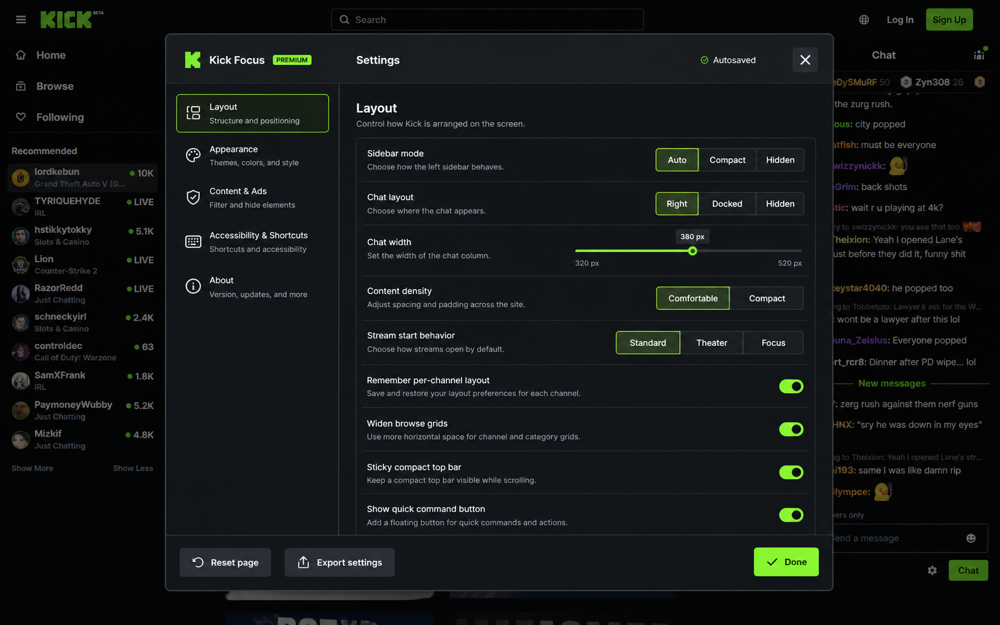

# Kick Focus

Kick Focus is a desktop-only userscript that gives [Kick](https://kick.com/) a calmer, more controllable layout. It adds focus and theater modes, compact discovery, a complete settings center, accessibility controls, content filters, and a best-effort document-start ad defense without shipping remote code.



## What it changes

- Reclaims the permanent 256 px discovery rail with Auto, Compact, and Hidden modes.
- Adds Standard, Theater, and Focus stream layouts, plus Right, Docked, and Hidden chat.
- Widens browse grids and preserves a compact, sticky desktop top bar.
- Adds a searchable command menu (`Ctrl+K`) and configurable keyboard shortcuts.
- Adds Studio, OLED, and Slate surfaces, four accent choices, density, radius, thumbnail, contrast, and text controls.
- Pauses home autoplay once, blurs marked mature cards, and can filter labeled casino, Drops, sponsored, and promoted content.
- Blocks known separable ad and optional telemetry requests through early page-realm `fetch`, XHR, beacon, and dynamic-element hooks; a persistent observer removes known ad scripts, frames, and containers after reinsertion.
- Stores settings locally in the userscript manager. There is no analytics, network update code, `@require`, or remote configuration.

## Install

1. Install a current desktop userscript manager such as Tampermonkey or Violentmonkey.
2. Open `dist/kick-focus.user.js` in the manager, or create a new userscript and paste that file into the editor.
3. Save it, ensure it is enabled for `https://kick.com/*`, and reload Kick.
4. Use the **Focus** button, press `Ctrl+K`, or choose **Open Kick Focus settings** from the manager menu.

The script is not published or auto-updated. `dist/kick-focus.user.js` is the canonical install artifact in this repository.

## Default shortcuts

| Action | Shortcut |
| --- | --- |
| Command menu | `Ctrl+K` |
| Focus mode | `F` |
| Toggle chat | `C` |
| Toggle sidebar | `S` |
| Settings | `Alt+K` |
| Reveal mature thumbnails | `B` |

Plain-letter shortcuts do not fire while typing in an input, textarea, select, or editable chat surface. Conflicting custom shortcuts are rejected with an inline recovery state.

## Ad-defense boundary

Kick Focus is deliberately honest about the userscript boundary:

- `@run-at document-start` starts as early as a userscript manager supports, but another page script can still run first.
- On Chromium Manifest V3, current Tampermonkey versions no longer expose the experimental pre-script `@webRequest` path.
- Kick Focus therefore blocks requests it can separate in the page realm and continuously removes ad DOM. It does not claim browser-network control over parser requests that occur first, worker-only requests, or server-side stitched media.
- A future optional Manifest V3 companion using `declarativeNetRequest` is the path to browser-level pre-request guarantees; see [ROADMAP.md](ROADMAP.md).

This boundary is reflected directly in the Content & Ads settings page and protection log.

## Desktop support

- Primary verified viewport: 1440×900
- Secondary verified viewport: 1920×1080
- Audited logged-out routes: Home, Browse, Categories, Clips, Category, Channel, search suggestions, search results, and Log In modal
- Tested browser surface: current Chromium-based in-app browser on 2026-08-14
- Mobile is intentionally out of scope.

Kick changes frequently. The most brittle hooks are the sidebar and chat selectors documented in [RESEARCH.md](RESEARCH.md). If the player or chat fails, disable Kick Focus first; Kick’s own help center notes that ad/privacy/script blockers can interfere with playback and chat.

## Build and verify

No runtime or development dependencies are required beyond Node.js 20+.

```powershell
npm run build
npm run verify
```

The build concatenates the metadata block, tested pure core, and runtime into `dist/kick-focus.user.js`. Verification checks metadata, syntax, remote-code absence, SPA/ad-defense markers, and the core test suite.

## Repository map

```text
design/mockups/       Selected ImageGen direction and all settings-page mocks
dist/                 Installable userscript
scripts/              Deterministic build and artifact checks
src/core.mjs          Settings, routing, blocklist, and validation logic
src/runtime.js        Live DOM, layout, settings UI, commands, and request hooks
test/                  Node test suite
```

See [RESEARCH.md](RESEARCH.md) for the dated audit and evidence, [ROADMAP.md](ROADMAP.md) for prioritized follow-up work, and [CHANGELOG.md](CHANGELOG.md) for release history.

Kick Focus is an independent project and is not affiliated with or endorsed by Kick Streaming.
